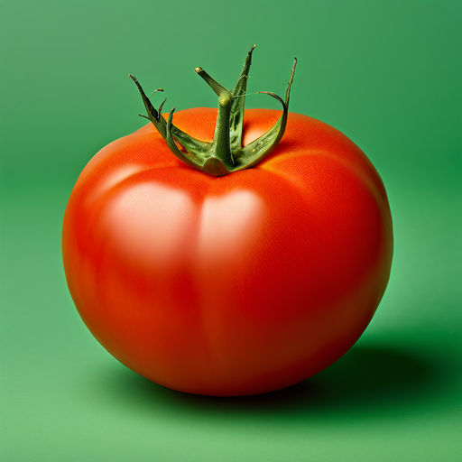
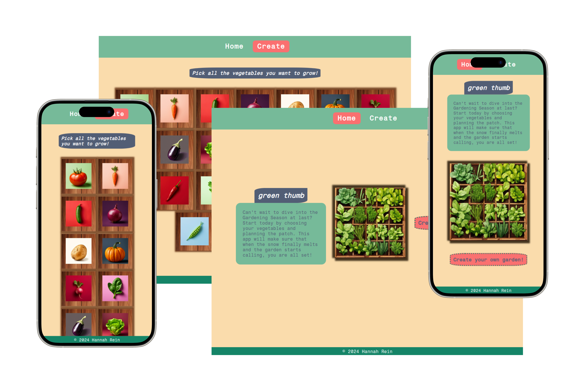

# Green Thumb

This intuitive web application is your perfect companion for planning and organizing your vegetable garden. With Green Thumb, you can select your favorite vegetable plants and arrange them in your garden bed while ensuring they have the best neighbors for optimal growth.

## Project Overview

Green Thumb helps gardening enthusiasts plan their vegetable patches by providing valuable insights into companion planting. Some vegetables thrive better when planted next to specific species, and Green Thumb makes it easy to visualize and arrange these beneficial pairings.

## Features

- **Choose Your Vegetables**: Select from a variety of vegetable plants to add to your garden.
- **Arrange Your Garden Bed**: Move vegetables around your garden bed and see which plants make good neighbors to each other.
- **Planting Guidelines**: Get detailed guidelines on pre-cultivation or direct sowing for each vegetable.

## About this project

Green Thumb was created as a personal project for a practical application of React. This project offered a hands-on opportunity to deepen my understanding of [React](https://reactjs.org/), [Vite](https://vitejs.dev/) and [associated libraries](https://github.com/ReactTraining/react-router), allowing me to enhance my skills through practical experience.

## Explore the Website

Green Thumb is live and ready for you to explore at: [https://greenthumb.onrender.com](https://greenthumb.onrender.com)

## Screenshot

